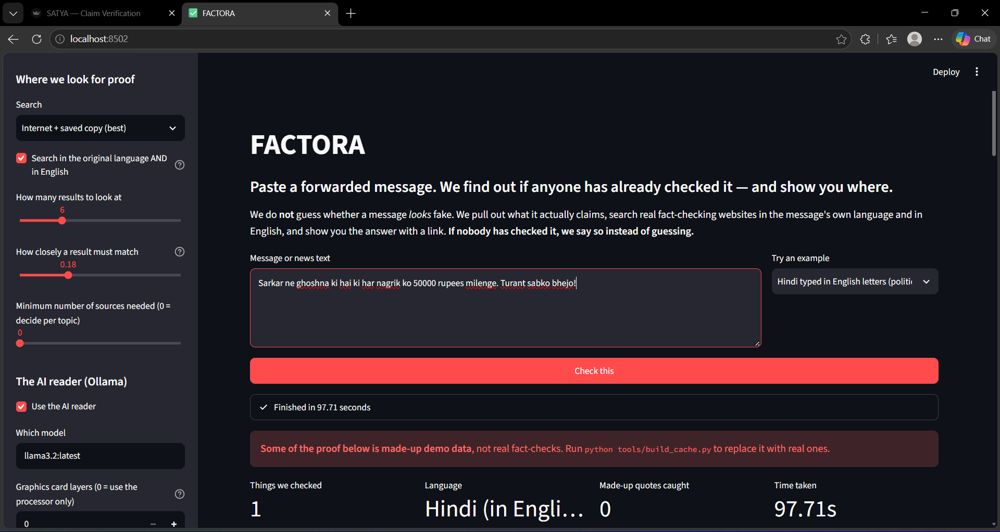
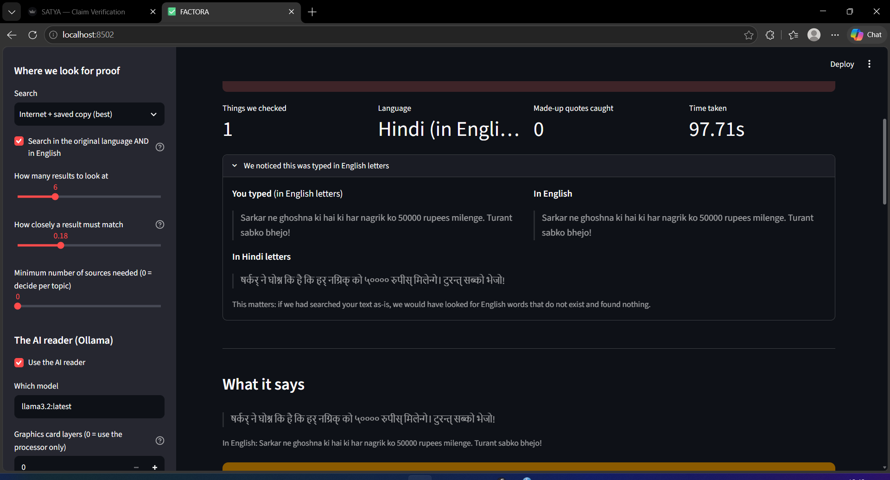

# FACTORA

### Claim-Level Misinformation Verification for Tamil, Hindi and English

---

## Problem Statement

| | |
|---|---|
| **Problem Statement ID** | **AI-03** |
| **Title** | AI-Powered Fake News Detection |
| **Domain** | AI / ML |
| **Event** | Technical Hackathon — 4 Hour Event |
| **Challenge Level** | High |

**As given by the organisers:**

> Build an AI/ML system that analyses a news article or user-provided text and
> predicts whether the content is potentially reliable or misleading. The system
> should analyse textual patterns and provide an explanation or confidence score
> for its prediction.
>
> **Expected features:** news/article text input · text preprocessing ·
> ML classification · confidence score · key indicators/reasoning ·
> result dashboard.

---

## Team

| # | Name | College | Email |
|---|---|---|---|
| 1 | **HARSHINI A** | CIT | harshinicat15@gmail.com |
| 2 | **ARIVUSELVAN S** | CIT | sarivuselvan@gmail.com |
| 3 | **BALADHARUNESH B** | CIT | baladharunesh@gmail.com |
| 4 | **SARVESH A K** | CIT | sarveshbala27@gmail.com |

---

## What FACTORA Does

**In one line:** paste a forwarded message, and FACTORA finds out whether any
real fact-checker has already examined it — and shows you where.

Most systems ask *"does this text look fake?"* That question has no good answer.
FACTORA asks a different one: *"what exactly is this text claiming, and has
anyone already checked it?"* — and that question has an answer that comes with
a URL.

Given a WhatsApp forward, a claim, or a news article, FACTORA:

1. detects Tamil/Hindi typed in English letters and converts it to the proper
   script **before** identifying the language, then produces an English version;
2. splits the input into individual factual claims and scores each one for
   whether it is worth checking;
3. works out the topic of each claim, which decides where to look, how strict
   to be, and whether a computer is allowed to judge it at all;
4. searches published fact-checks along **two paths at once** — the claim's own
   language and the English version — and flags old debunked content that is
   circulating again;
5. asks a local Ollama model for a verdict **based only on the retrieved
   passages**;
6. **checks every quote the model gives against the source text** and throws
   away anything it invented;
7. combines the signals behind a set of evidence gates and returns one of four
   answers, always with its sources.

### The four answers

| Answer | Shown as | Meaning |
|---|---|---|
| `REFUTED` | ✖ **FALSE** | Fact-checkers looked at this and found it wrong |
| `SUPPORTED` | ✔ **TRUE** | Fact-checkers looked at this and found it correct |
| `INSUFFICIENT_EVIDENCE` | ? **NOT ENOUGH PROOF** | Nobody has checked this, so we will not guess |
| `ESCALATE` | ! **A PERSON MUST CHECK THIS** | Too sensitive for a computer to judge alone |

**NOT ENOUGH PROOF is a designed output, not a failure.** It is the state a
trained classifier is architecturally incapable of producing.

---

## Screenshots

### Main screen



Plain-English interface. The sidebar exposes every threshold in the system —
where to search, how closely a result must match, which Ollama model, how much
each signal counts. Nothing is hardcoded.

### Language handling — Hindi typed in English letters



The input `"Sarkar ne ghoshna ki hai ki har nagrik ko 50000 rupees milenge.
Turant sabko bhejo!"` is recognised as Hindi written in Latin script, converted
to Devanagari, and carried forward in both forms. Without this step the system
would search for English words that do not exist and find nothing.

---

## Why Not a Trained Classifier

This is the central design decision, and the evidence against the obvious
approach is unambiguous:

- **Shortcut learning.** On the LIAR dataset, XGBoost and Extra Trees reach
  training accuracy near 1.000 and collapse to ≈0.25 on test — a gap over 74%.
  The models memorise political entities and campaign slogans; those shortcuts
  fail completely on unseen statements.
- **Collapse under realistic evaluation.** Rumour-detection models tested on
  chronological splits — simulating genuinely new rumours rather than random
  held-out data — drop by **as much as 40%**.
- **Style ≠ truth.** A detector can be highly accurate at identifying whether
  text was machine-generated while performing near chance on whether it is
  *true*.

**FACTORA trains nothing.** Retrieval-based verification has no decision
boundary over topics to overfit.

---

## Architecture

```
USER INPUT  (text │ article │ message)
      │
      ▼
PREPROCESS / LANGUAGE          transliterate → detect → translate
      │                        (original text kept alongside)
      ▼
CLAIM EXTRACTION               split → score worth-checking → N claims
      │
      ├──────────────┬──────────────────┐     (each claim, independently)
      ▼              ▼                  ▼
 RULE-BASED     ML PRIOR          TOPIC
 ta│hi│en       (structural)      CLASSIFIER
 lexicon
      └──────────────┴──────────────────┘
                     ▼
              ╔═════════════╗
              ║ SIGNAL BUS  ║═══════════════════╗
              ╚══════╤══════╝                   ║
                     ▼                          ║
              SEARCH ROUTER                     ║
        keyword │ semantic │ hybrid (RRF)       ║
                     ▼                          ║
              RAG RETRIEVAL                     ║
        dual path: ta/hi native + en pivot      ║
        union → dedupe → RELEVANCE GATE         ║
        → resurfacing check                     ║
                     ▼                          ║
               EVIDENCE PACK                    ║
                     ▼                          ║
        OLLAMA — GROUNDED ONLY                  ║
        in: passages + claim, nothing else      ║
        out: JSON {stance, cited_ids,           ║
                   quoted_span, reasoning}      ║
                     ▼                          ║
        GROUNDING VALIDATOR                     ║
        quote verbatim in a cited passage?      ║
        cited ids exist? stance warranted?      ║
        any failure → NOT_IN_CONTEXT            ║
                     ▼                          ║
        SCORE ENGINE  ◀═════════════════════════╝
        gates first, then weighted fusion
                     ▼
   FALSE │ TRUE │ NOT ENOUGH PROOF │ A PERSON MUST CHECK
                     ▼
                 DASHBOARD
```

### Four decisions that carry the design

**1. Transliteration runs before language identification.** Indians routinely
type Tamil and Hindi in Latin script. A pipeline that identifies the language of
the raw string labels romanised Tamil as English, retrieves nothing, and returns
silent garbage.

**2. The signal bus.** Rule score, ML prior and topic are computed once and
consumed **twice** — by the router to pick a search strategy, and by the score
engine to contribute to the final answer. In the first draft those two signals
reached the router and then vanished, so they never influenced the verdict.

**3. The relevance gate.** Retrieval always returns its top-K whether or not
anything actually matched. Passages that are not about the claim are discarded
**before** the score engine sees them. *This was found by a real failure during
the build — see "Bugs Found and Fixed" below.*

**4. The escalation gate lives in the score engine, not the router.** Policy is
applied at the point of decision, so a routing bug cannot bypass it.

---

## The Grounding Validator

This is the component that makes the AI stage defensible.

A 3B model does not know Indian facts well enough to judge them. On the
IndicParam benchmark, 3–4B models score 16–50 on Indic factual tasks; even
Gemma4 31B reaches only 56.9–66.9% weighted accuracy across ten Indic languages
on L3Cube-IndicQuest v2. **So the model is never asked whether a claim is
true.** It receives the claim and the retrieved passages and nothing else, and
`NOT_IN_CONTEXT` is an explicitly legal answer.

That constraint is then *enforced*, not merely requested:

| Check | Catches |
|---|---|
| **Span check** | the quoted text must actually occur in a cited passage — invented or paraphrased quotes die here |
| **Citation check** | every cited passage id must exist — citing `[PASSAGE 7]` when only 0–2 were supplied is fabrication |
| **Warrant check** | a confident stance with zero citations is an unwarranted assertion |

Any failure forces `NOT_IN_CONTEXT`, which the score engine turns into
NOT ENOUGH PROOF. Every rejection is logged and shown in the dashboard, because
a caught hallucination is evidence the safeguard works.

```bash
python tests/test_grounding.py
```

Runs eight adversarial cases — invented spans, paraphrases, fabricated
citations, uncited assertions, over-short quotes — and shows each being caught.
**Result: 8 behaved as specified, 0 did not.** No network, no Ollama, under a
second.

---

## The Score Engine

Gates run **before** the fused score is consulted, so a high "suspicious
wording" score can never on its own produce a FALSE verdict:

```
1. topic is religious/communal          -> A PERSON MUST CHECK THIS
2. fewer relevant sources than required -> NOT ENOUGH PROOF
3. the AI abstained (NOT_IN_CONTEXT)    -> NOT ENOUGH PROOF
4. grounding validator rejected output  -> NOT ENOUGH PROOF
5. sources disagree above threshold     -> A PERSON MUST CHECK THIS
6. otherwise                            -> fused score decides
```

```
final = 0.45·AI_reading + 0.30·proof_found + 0.15·writing_style + 0.10·wording
```

Evidence dominates by design. The two wording scores together are 25% — priors
that break ties, never the verdict.

---

## Topic Routing

Topic decides four things at once, because different claim types have ground
truth in **different places**. A sports result is checkable against structured
data, a health claim against authority documents, a political claim against the
fact-check corpus, and a communal claim often cannot be auto-checked at all.

| Topic | Strategy | Harm weight | Automated verdict? |
|---|---|---|---|
| political | hybrid | 0.80 | yes, high threshold |
| health | hybrid | 0.95 | yes, strictest threshold |
| **religious / communal** | hybrid | 1.00 | **NO — always escalates** |
| crime | hybrid | 0.85 | yes, with provenance |
| sports | keyword | 0.10 | yes, deterministic |
| entertainment | keyword | 0.15 | yes, low budget |
| finance / scam | hybrid | 0.85 | yes |

**Communal content never receives an automated verdict.** Religious
misinformation threatens social cohesion and mob killings in India have followed
false rumours; an incorrect automated label there causes the very harm the
system exists to prevent. Hard-coded in `config/categories.yaml`, enforced at
gate 1.

Published category distributions disagree on weights — one study puts politics
at 46%, another puts health at 27.2% and politics at 24.3%, and the mix shifts
by channel and period. That disagreement is exactly why this is a config file
and not a hardcoded prior.

---

## Tech Stack

| Stage | Tool | Why |
|---|---|---|
| Dashboard | **Streamlit** | fast to build, runs locally |
| Config | **PyYAML** | every threshold externalised |
| Transliteration | **indic-transliteration** (ITRANS) | pure Python, works offline |
| Language ID | custom Unicode-range + romanised marker detection | no model needed |
| Translation | **Ollama** (`llama3.2:latest`) | no PyTorch download required |
| Claim extraction | rule-based regex + feature scoring | fully explainable |
| Keyword search | **rank-bm25** | pure Python |
| Fusion | **Reciprocal Rank Fusion** | merges rankings without comparable scores |
| Fact-check corpus | **Google Fact Check Tools API** (`claims.search`) | free, structured ClaimReview, language-filterable |
| AI reasoning | **Ollama** + `llama3.2:latest`, CPU only | local, no API cost, no data leaves the machine |
| Honesty check | custom **grounding validator** | deterministic, not a prompt |

**Runtime:** Python 3.10+ · **CPU only** · **zero models trained** · Ollama on
`localhost:11434` · works fully offline with `--backend offline`.

### Deliberately NOT used

No `torch`, `transformers`, `sentence-transformers` or `spaCy`. Those are
multi-GB downloads that would not survive venue wifi, and every capability
needed is either pure-Python or delegated to the locally-installed Ollama.

---

## Setup and Running

### 1. Install

```bash
cd D:\FAKE-NEWS-DETECTION
pip install -r requirements.txt
```

### 2. Verify the environment

```bash
python check_env.py
```

Prints Python version, RAM, Ollama models, package status and network checks.

### 3. Ollama

```bash
ollama serve          # leave this running in its own terminal
ollama pull llama3.2  # if no model is present
python tools/test_ollama.py --num-gpu 0 --ctx 2048
```

> **Important:** keep GPU layers at **0**. On hardware whose driver does not
> match Ollama's CUDA build, the model crashes at load with
> `CUDA error: device kernel image is invalid`. CPU-only avoids this entirely
> and is what this project targets.

### 4. API key (optional but recommended)

Get a key from the [Google Cloud Console](https://console.cloud.google.com/apis/library/factchecktools.googleapis.com)
and save it to a file named `.apikey` in the project root. It is gitignored.

### 5. Build the offline evidence cache

```bash
python tools/build_cache.py --langs en,ta,hi --per-query 10
```

Fetches real ClaimReview records so the system keeps working with the wifi off.
**Our build: 434 unique records — 294 English, 112 Hindi, 28 Tamil.**

### 6. Run

```bash
# dashboard
python -m streamlit run app.py

# single claim, command line
python cli.py --text "Video shows PM Modi saying Today, India is the world's second largest beef producer" --format text --topk 3

# fully offline, no AI
python cli.py --text "..." --backend offline --no-llm --format text

# the honesty check
python tests/test_grounding.py

# inspect what evidence you have
python tools/show_cache.py --rated-only --limit 10
python tools/show_cache.py --resurfaced --limit 5
```

> If `streamlit` is "not recognized", its launcher is not on PATH. Use
> `python -m streamlit run app.py` instead.

---

## Key Command-Line Options

Every threshold is a flag. Nothing behavioural is hardcoded in `src/`.

```
# input
  --text TEXT | --file PATH

# language
  --langs ta,hi,en            --translit-backend auto|rule|llm|off
  --transliterate-romanized true|false

# retrieval
  --backend api|offline|hybrid        --dual-path true|false
  --topk N                            --min-relevance FLOAT
  --evidence-min-sources N            --resurface-gap-days N
  --router-strategy auto|keyword|semantic|hybrid

# AI reader
  --llm-model NAME       --llm-ctx N        --llm-num-gpu N
  --llm-timeout SEC      --llm-max-claims N --no-llm
  --llm-only-when-ambiguous true|false

# honesty check
  --grounding true|false    --grounding-strictness exact|normalized
  --min-span-chars N

# scoring
  --w-llm 0.45  --w-retrieval 0.30  --w-ml 0.15  --w-rule 0.10
  --stance-threshold FLOAT   --conflict-threshold FLOAT
  --never-auto-verdict religious,communal

# output
  --format text|json   --out DIR   --quiet
```

---

## Project Layout

```
FAKE-NEWS-DETECTION/
├── app.py                     Streamlit dashboard
├── cli.py                     command line, every threshold a flag
├── check_env.py               environment verification
├── requirements.txt
├── .apikey                    (you create this; gitignored)
├── config/
│   ├── settings.yaml          all defaults
│   ├── categories.yaml        routing policy per topic
│   └── lexicon.yaml           Tamil/Hindi/English manipulation lexicon
├── src/
│   ├── models.py              typed objects passed between layers
│   ├── config.py              config loading + CLI override merge
│   ├── language.py            transliterate → detect → translate
│   ├── claims.py              splitting + worth-checking score
│   ├── rules.py               lexicon + structural signals
│   ├── router.py              topic classifier + strategy selection
│   ├── retrieve.py            dual-path retrieval, RRF, relevance gate
│   ├── llm.py                 Ollama client, grounded prompting
│   ├── grounding.py           the honesty validator
│   ├── score.py               gates + fusion
│   └── pipeline.py            orchestration
├── tests/test_grounding.py    8 adversarial validator cases
├── tools/
│   ├── build_cache.py         fetch real ClaimReview records
│   ├── show_cache.py          inspect evidence, pick demo claims
│   └── test_ollama.py         Ollama diagnostic
├── cache/
│   ├── claimreview.json       real fact-checks (built by you)
│   └── sample_corpus.json     labelled synthetic fallback
└── docs/                      screenshots
```

---

## Bugs Found and Fixed During the Build

Both were found by testing, not by luck, and both are worth stating openly.

### 1. Confident verdicts on irrelevant evidence

Running the system on a meaningless placeholder string returned
**FALSE at 0.803 confidence**, citing four unrelated fact-checks about Trump,
Iran, a temple conversion and Gabbard.

**Cause:** the score engine assumed whatever retrieval returned was *evidence*.
Retrieval had done its job — those genuinely were the highest-ranked results —
but none of them were about the claim.

**Fix:** a **relevance gate**. Every passage is scored for content-word overlap
with the claim, and anything below `--min-relevance` is discarded before
scoring. The dashboard reports how many were thrown away and why.

**Demonstrate it:**
```bash
python cli.py --text "<CLAIM>" --format text --min-relevance 0.0 --no-llm   # FALSE on junk
python cli.py --text "<CLAIM>" --format text --no-llm                        # NOT ENOUGH PROOF
```

### 2. The AI skip heuristic removed the safety net

`--llm-only-when-ambiguous` was skipping the AI whenever *rated* passages
existed, regardless of whether they matched — removing the one component capable
of answering `NOT_IN_CONTEXT`. It now requires a strong relevance match before
skipping.

---

## Honest Limitations

Stated here so they are stated before anyone else finds them.

1. **Fact-check coverage skews English.** Our cache is 294 English, 112 Hindi,
   **only 28 Tamil**. Dual-path retrieval is the mitigation, not a cure.
2. **Transliteration of colloquial romanised text is imperfect.** The
   rule-based ITRANS mapping handles formal spellings well and colloquial
   spellings poorly. The method used is recorded in every report
   (`translit_method`). IndicTrans2 from AI4Bharat is the correct production
   choice and is on the roadmap — it was excluded today only because it
   requires a multi-GB PyTorch download.
3. **Translation runs through a 3B local model**, not a dedicated translation
   model, for the same reason.
4. **Search is keyword and word-overlap based**, not embeddings.
5. **The "ML prior" is not a trained classifier** and is labelled as such
   everywhere it appears. Shipping a trained veracity classifier would
   contradict the argument this project is built on.
6. **`cache/sample_corpus.json` is synthetic** — invented records with
   placeholder publishers and `example.invalid` URLs, flagged
   `_synthetic: true`, discounted in scoring, and shown behind a red banner.
7. **Speed.** Roughly 20–100 seconds per claim on CPU, depending on how many
   passages the model reads. `--topk 3` and `--llm-only-when-ambiguous` reduce
   this.

---

## Roadmap

1. **IndicTrans2** for proper translation across all 22 scheduled Indian languages
2. **Sentence embeddings** for meaning-based search
3. **Reverse image search** — 30% of misinformation images in Indian WhatsApp
   groups are memes carrying fake quotes or statistics, which a text-only system
   cannot see
4. **More Tamil sources** to close the 28-vs-294 gap
5. **A review queue** for the escalated communal cases
6. **WhatsApp bot** — the system works; it needs to be where forwards arrive
7. **Compliance API.** India's IT Amendment Rules 2026 cut the takedown deadline
   for flagged unlawful content from 36 hours to 3. No platform can review at
   that speed with humans alone.

---

## Verified Results

| Capability | Status |
|---|---|
| Romanised Tamil/Hindi detection | ✅ Hindi detected, converted to Devanagari |
| Dual-path retrieval | ✅ `api:en` + `offline:en` |
| Relevance gate | ✅ 8/8 irrelevant passages discarded |
| Topic routing | ✅ political 1.00, health 1.00 |
| Escalation gate | ✅ religious → A PERSON MUST CHECK THIS |
| Resurfacing detection | ✅ +3678 days on an Alt News debunk |
| Ollama stance, CPU-only | ✅ CONTRADICT, grounding passed |
| **Grounding validator** | ✅ **8/8 adversarial cases caught** |
| All four answers reachable | ✅ |
| Real evidence | ✅ 434 records — 294 en, 112 hi, 28 ta |

---

## Sources

**Why retrieval, not classification**
- Generalization Gaps in Political Fake News Detection (LIAR) — https://arxiv.org/html/2512.18533v1
- Generalizing Misinformation Detection to Unseen Events — https://lacuna.tiptreesystems.com/direction/generalizing-misinformation-detection-to-unseen-events/txn_c7cd5ed992f14bec8c09419aaa3bcfd5
- Towards Real-Time Fake News Detection under Evidence Scarcity — https://arxiv.org/html/2510.11277v1
- The Limitations of Stylometry for Detecting Machine-Generated Fake News — https://pith.science/paper/1908.09805

**Small models on Indic factual tasks**
- IndicParam benchmark — https://arxiv.org/pdf/2512.00333
- L3Cube-IndicQuest v2 — https://arxiv.org/pdf/2608.15535

**Retrieval**
- Google Fact Check Tools API — https://developers.google.com/fact-check/tools/api
- `claims.search` reference — https://developers.google.com/fact-check/tools/api/reference/rest/v1alpha1/claims/search

**Corpus and categories**
- FactDRIL (multilingual Indian fact-check dataset) — https://arxiv.org/pdf/2102.11276
- Fact-Checking India (ISB Institute of Data Science) — https://www.isb.edu/faculty-and-research/isb-institute-of-data-science/fact-checking-india
- Social Media Fake News in India (AJPOR) — https://www.ajpor.org/article/19049-social-media-fake-news-in-india

**Scale and impact**
- The Virality Gap (IJERT) — https://www.ijert.org/the-virality-gap-political-misinformation-and-the-information-crisis-in-india-s-digital-democracy-ijertv15is050041
- Images and misinformation in WhatsApp political groups (HKS Misinformation Review) — https://misinforeview.hks.harvard.edu/article/images-and-misinformation-in-political-groups-evidence-from-whatsapp-in-india/
- How India's Fact-Checking Ecosystem Works — https://www.indianrepublic.in/2026/06/how-indias-fact-checking-ecosystem-works.html
- PIB Fact Check Unit FAQ — https://www.pib.gov.in/FAQ_fact.aspx?reg=48&lang=2

**Regulatory driver**
- India's IT Amendment Rules 2026 — https://thelegalhubb.com/indias-it-amendment-rules-2026-explained-how-the-new-law-regulates-deepfakes-and-ai-generated-content/
- India targets deepfakes (Freshfields) — https://www.freshfields.com/en/our-thinking/blogs/technology-quotient/india-targets-deepfakes-and-ai-generated-content-key-changes-under-meitys-2026-102mjwn

**Language stack (roadmap targets)**
- AI4Bharat IndicTrans2 — https://github.com/AI4Bharat/IndicTrans2
- AI4Bharat models — https://models.ai4bharat.org/
- Bhashini (MeitY) — https://www.microsoft.com/en-in/aifirstmovers/bhashini
